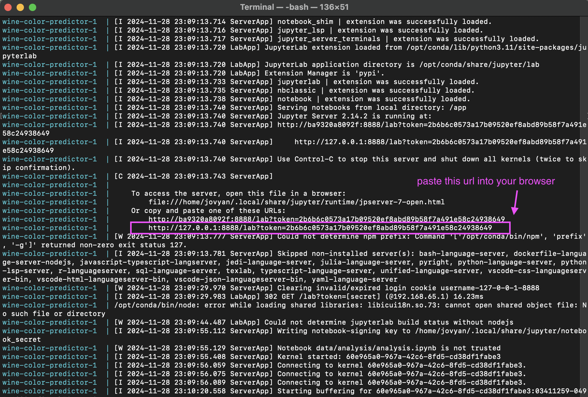

# Wine Chromatic Profile Classification
Authors: Farhan Bin Faisal, Daria Khon, Adrian Leung, Zhiwei Zhang

DSCI 522 (Data Science Workflows) Project

# About
In this project we created a classification model to predict the type of wine (red or white) based on its physicochemical properties, such as acidity, sulfates, citric acid, etc. The logistic regression model was selected for its simplicity and effectiveness in binary classification tasks. Our classifier demonstrated excellent performance on unseen data, achieving test accuracy of 0.99. Out of 1,950 instances, only 15 were misclassified, showcasing the model's reliability and its potential for practical applications in wine quality assessment and categorization.
<br> <br>
The data set we used in this project was created by By P. Cortez, A. Cerdeira, Fernando Almeida, Telmo Matos, J. Reis. 2009 as part of Decision Support Systems publication, and is available on UCI Machine Learning Repository [here](https://archive.ics.uci.edu/dataset/186/wine+quality). 

# Report
The final report can be found [here](https://ubc-mds.github.io/DSCI522-2425-22-wine-chromatic-profile/).

# Dependencies
- [Docker](https://www.docker.com/)
- [Jupyter Lab](https://jupyter.org/)
- or [VS CODE with Jupyter Extension](https://marketplace.visualstudio.com/items?itemName=ms-toolsai.jupyter)

# Usage
> Note: Docker Desktop is required for this workflow. Make sure it is installed and running before proceeding.
## Running the analysis

1. Clone this repository `git clone`
2. Enter the root project direcory on your local repository and run:  
    ```
    docker-compose down --rmi all --volumes
    docker-compose up
    ```
3. In the terminal, look for a URL that starts with http://127.0.0.1:8888/lab?token= (see sample terminal output below). Copy and paste that URL into your browser.


4. Once in a docker container, open a terminal and run:
   ```
   make clean
   make all
   ```
5. To clean up and start fresh at any point, run:
   ```
   make clean
   ```

### Clean up

To shut down the container and clean up the resources, 
type `Cntrl` + `C` in the terminal
where you launched the container, and then type `docker compose rm`

## Developer notes

### Developer dependencies
- `conda` (version 23.9.0 or higher)
- `conda-lock` (version 2.5.7 or higher)

### Adding a new dependency

1. Add the dependency to the `environment.yml` file on a new branch.

2. Run `conda-lock -k explicit --file environment.yml -p linux-64` to update the `conda-linux-64.lock` file.

2. Re-build the Docker image locally to ensure it builds and runs properly.

3. Push the changes to GitHub. A new Docker
   image will be built and pushed to Docker Hub automatically.
   It will be tagged with the SHA for the commit that changed the file.

4. Update the `docker-compose.yml` file on your branch to use the new
   container image (make sure to update the tag specifically).

5. Send a pull request to merge the changes into the `main` branch. 

### To run pipeline components individually

4.1 Download, clean, split and validate the data:
```
   python scripts/download.py \
      --id 186 \
      --save_to ./data/raw/wine.csv

   python scripts/clean_n_split_data.py \
      --raw-data ./data/raw/wine.csv
   
   python scripts/validation_before_split.py \
      --file_name wine.csv \
      --data_path ./data/raw

```
4.2 Run EDA
```
   python scripts/eda_n_correlation_check.py \
      --train-file ./data/proc/wine_train.csv \
      --output-img ./results/figures \
      --output-table ./results/tables
```
4.3 Preprocess data and run it through the Logistic Regression model:
```
   python scripts/preprocessing.py \
      --pipe-to ./results/models

   python scripts/model_evaluation_wine_predictor.py \
      --train-data ./data/proc/wine_train.csv \
      --test-data ./data/proc/wine_test.csv \
      --pipeline-path ./results/models/wine_pipeline.pickle \
      --table-to ./results/tables \
      --plot-to ./results/figures
```
4.4 Generate a Quarto report .html and/or .pdf:
```
   quarto render report/report.qmd --to html
   quarto render report/report.qmd --to pdf
```

### Running the test suite
Use the same docker compose up command as described in the Running the analysis section above to launch Jupyter lab. Tests are run using the pytest command in the root of the project. More details about the test suite can be found in the tests directory.

# License
This project was created with the [`MIT License`](LICENSE.md)

# References
Cortez P, Cerdeira A, Almeida F, Matos T, Reis J. Wine Quality [dataset]. 2009. UCI Machine Learning Repository. Available from: https://doi.org/10.24432/C56S3T.
